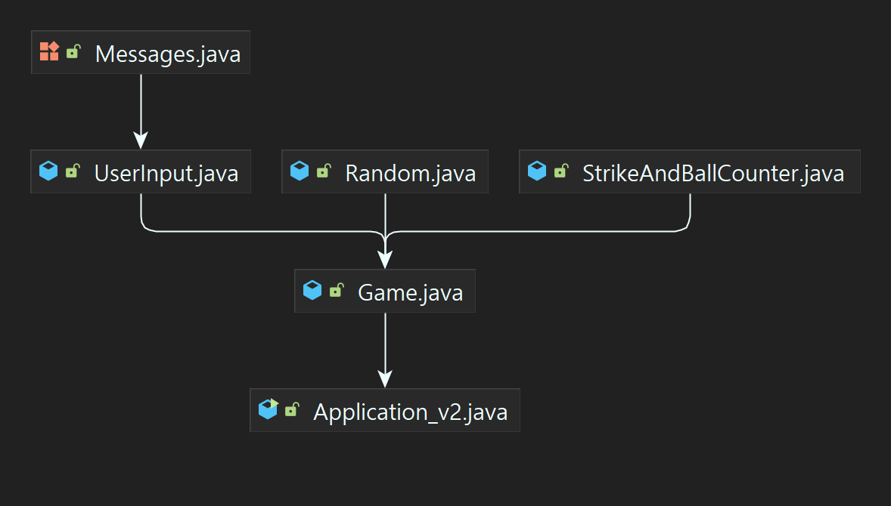

# 🌟 Toy Project : 숫자 야구게임 개발 
    우아한 테크코스 프리코스 미션 중 하나인, 숫자야구게임을 이용한 프로젝트를 실시한다.
    해당 게임을 우선 콘솔기반 게임으로 구성하기로 하자.
    먼저 하나의 클래스로 모든 실행 흐름을 제어하도록 한다.
    그 후 기능 및 응집도 관점에서 클래스의 분리를 고려하여 리팩토링 한다.
    
    이후 웹기반 어플리케이션으로 적용하고, 기능을 추가하여, 온전한 웹어플리케이션 을 만들어보기로 한다.


---


# 🐋 1. 기능 요구 사항
    1~9까지 서로 다른 수로 이루어진 3자리 수를 맞추는 게임.
    컴퓨터는 랜덤한 서로다른 세자리 숫자를 생성하며, 이를 게임의 유저(클라이언트)가 맞추면 승리하며 게임은 종료된다.
    유저는 컴퓨터의 숫자를 추론한 3자리 서로다른 수를 제시하며, 컴퓨터는 유저가 입력한 숫자에 대한 힌트를 제공한다.
    
    힌트는 다음과 같다.
     - 같은 자리 숫자가 일치할 경우 : n스트라이크
     - 같은 자리는 아니나, 일치하는 숫자가 존재할 경우 : n볼
     - 어떤 숫자도 포함되지 않을 경우 : 낫싱
    
    컴퓨터의 숫자를 유저가 맞춘 후, 게임이 종료될 시, 유저는 게임을 다시 시작하거나 혹은 완전히 종료할 수 있다.
    사용자가 잘못된 값을 입력할 경우, IllegarArgumentException을 발생시킨 후, 애플리케이션은 종료되어야 한다.

 - ## 1.1 게임 실행 예시
```
 숫자 야구 게임을 시작합니다.
 (For Example, a Computer number is 264)
 숫자를 입력해 주세요 : 321
 1볼
 숫자를 입력해 주세요 : 213
 1스트라이크
 숫자를 입력해 주세요 : 246
 1스트라이크 2볼
 숫자를 입력해 주세요 : 264
 3스트라이크
 3개의 숫자를 모두 맞히셨습니다! 게임 종료
 게임을 재시작 하시겠습니까? (Y/N)
 Y
 (For Example, a Computer number is 649)
 숫자를 입력해 주세요 : 649
 3스트라이크
 3개의 숫자를 모두 맞히셨습니다! 게임 종료
 게임을 재시작 하시겠습니까? (Y/N)
 N
```
---

# 🐋 2. 콘솔기반 게임 구현
- ## 2.1 : God class (version 1) 
Code Link : (https://github.com/Kwon-sang/toyProject/blob/master/src/main/java/v1/Application_v1.java)
> - version1 에서는 우선 하나의 클래스에 모든 기능을 구현하는, 'God class anti-pattern' 방식으로 구현한다.<br/>
> - 이러한 하나의 클래스에 모든 기능을 구현하는 것은 객체지향적 프로그래밍 보다는 오히려 절차지향적 프로그래밍에 가깝다.<br/>
> - 로직을 구성하는 코드 전반에 대한 이해가 필요하게 되어, 이는 유지보수가 힘들어지며 또한 확장에 있어서 에러를 발생시킬 가능성이 높다.<br/>
> - 기능이 추가됨에 따라 class 크기가 커질 경우, 문제는 더욱 복잡해진다.
> - 피해야 할 Anti-Pattern 이지만, 이를 기반으로 코드의 리팩토링 과정과 관점을 적용 및 개선해 볼 수 있을 것이다. 

- ## 2.2 : Refactoring (version 2)
Code Link : (https://github.com/Kwon-sang/toyProject/tree/master/src/main/java/v2)
> ### 기능의 분리에 관하여
> 숫자 야구 게임은 어떤 기능과 역할들로 구성되는가?<br/>
> 확장성 및 유지보수를 위한 코드개선에 앞서, 먼저 단일 책임의 원칙(SRP)에 따라 어떤 책임과 기능들의 집합으로 이루어져 있는지 고민해 볼 수 있을 것이다.<br/>
> 그리고 각 기능의 역할과 책임에 대하여, 응집도는 높으며 결합도가 낮은 코드가 될 수 있도록 변경할 수 있을 것이다.<br/>
> 내가 생각하기에, 숫자야구게임의 주요 기능은 아래와 같다.
> - 컴퓨터의 숫자를 생성하는 기능(1~9 범위의 랜덤한 3자리 숫자)
> - 유저의 3자리 숫자 입력
> - 컴퓨터와 유저의 숫자를 비교하여 스트라이크 or 볼 개수를 연산하는 기능
> - 해당 결과를 출력하는 기능
> 
> version2 에서는 기능의 집합을 정의하고, 이를 토대로 응집도와 결합도 측면을 고려하여 클래스를 분리하였다.   

> ### 클래스의 분리
> - `Application.java` : 메인 어플리케이션
> - `Game.java` : 게임 실행 흐름 제어(게임 로직 컨트롤러 혹은 서비스)<br/><br/>
> - `StrikeAndBallCounter.java` : 유저와 컴퓨터의 숫자를 기반으로, 스트라이크 개수와 볼 개수 속성값으로 저장<br/>
> - `UserInput.java` : 유저의 콘솔 입력 기능을 담당
> - `Random.java` : 3자리 랜덤한 숫자 생성<br/><br/>
> - `Messages` : 출력 메시지 관리를 위한 Enum

> ### Reference Diagram 
> <p align="center">